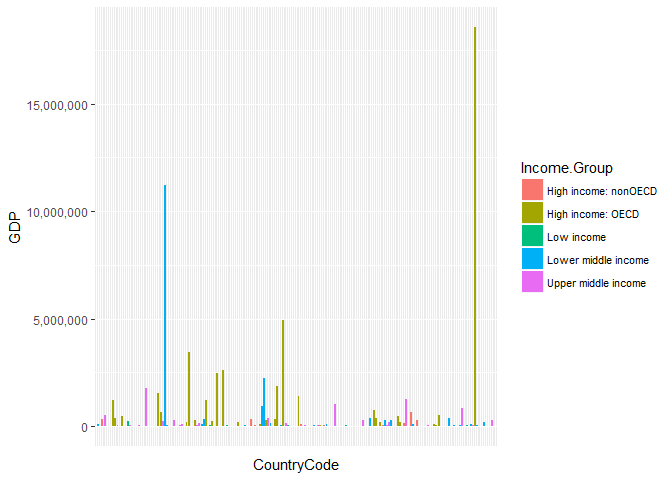

Analysis.Rmd
================
Festus Yaboah, Chris Havenstein, and Cam Lu
July 7, 2017

Analysis
========

#### To begin the analysis, please set your working directory to the Analysis folder.

Depending on the directory you cloned the "MSDS6306-CaseStudy1" into, the path to the "Analysis" folder should be similar to:

-   ./root/CaseStudy1/Analysis

By modifying "Analysis.Rmd" in the Analysis folder, I set an absolute path to the Analysis folder on my computer.

``` r
setwd("C:/Users/Chris/Desktop/GIT home/root/CaseStudy1/Analysis")
```

Then, source Makefile.R

``` r
source("./Data/Makefile.R")
```

    ## 
    ## 
    ## The number of Countries with no GDP value listed is: 22These 22 Countries have been removed from the GDP dataset
    ## 
    ## 
    ## CleanGDP.csv has been created.
    ## 
    ## 
    ## [1] "These 24 Aggregate groups that were not Countries have been removed from the EDSTATS_Country dataset:"
    ##     CountryCode                                      Long.Name
    ## 55          EAP          East Asia & Pacific (developing only)
    ## 56          EAS        East Asia & Pacific (all income levels)
    ## 57          ECA        Europe & Central Asia (developing only)
    ## 58          ECS      Europe & Central Asia (all income levels)
    ## 61          EMU                                      Euro area
    ## 85          HIC                                    High income
    ## 88          HPC         Heavily indebted poor countries (HIPC)
    ## 113         LAC    Latin America & Caribbean (developing only)
    ## 119         LCN  Latin America & Caribbean (all income levels)
    ## 120         LDC   Least developed countries: UN classification
    ## 121         LIC                                     Low income
    ## 124         LMC                            Lower middle income
    ## 125         LMY                            Low & middle income
    ## 136         MEA Middle East & North Africa (all income levels)
    ## 139         MIC                                  Middle income
    ## 144         MNA   Middle East & North Africa (developing only)
    ## 153         NAC                                  North America
    ## 160         NOC                           High income: nonOECD
    ## 164         OEC                              High income: OECD
    ## 182         SAS                                     South Asia
    ## 193         SSA           Sub-Saharan Africa (developing only)
    ## 194         SSF         Sub-Saharan Africa (all income levels)
    ## 218         UMC                            Upper middle income
    ## 228         WLD                                          World
    ## 
    ## CleanEDSTATS_Country.csv has been created.
    ## 
    ## MergeData.csv has been created from CleanGDP.csv and CleanEDSTATS_Country.csv.

At this point, Makefile.R has completed running and has loaded the merged data for analysis.

Question 1 on Merged Data:
--------------------------

#### Merge the data based on country shortcode. How many of the IDs match?

``` r
nrow(MergeData)
```

    ## [1] 187

*Answer*: There are 187 country shortcodes that match.

Question 2 on Merged Data:
--------------------------

#### Sort the data frame in ascending order by GDP (so United States is last). What is the 13th country in the resulting data frame?

``` r
MergeData <- MergeData[order(MergeData$GDP),]

MergeData[13,3]
```

    ## [1] "Samoa"

*Answer*: The 13th country in this reordered data is Samoa.

Question 3 on Merged Data:
--------------------------

#### What are the average GDP rankings for the "High income:OECD" and "High income: nonOECD" groups?

To proceed, we loaded the package "dplyr". If you do not have dplyr installed, you will need to run the R function for install.packages with dplyr passed as a parameter. This looks like the following, below.

-   install.packages("dplyr")

<!-- -->

    ## Warning: package 'dplyr' was built under R version 3.2.5

``` r
#Create a filtered data frame by income group = "High income: OECD".
Filter.Cat.OECD <-c("High income: OECD")
Filtered.OECD <- filter(MergeData,Income.Group %in% Filter.Cat.OECD)

#Create a second filtered data frame by income group = "High income: nonOECD".
Filter.Cat.nonOECD <-c("High income: nonOECD")
Filtered.nonOECD <- filter(MergeData,Income.Group %in% Filter.Cat.nonOECD)

#Find the average rank for both filtered data frames
Average.Rank.OECD <- mean(Filtered.OECD$Rank)
Average.Rank.nonOECD <- mean(Filtered.nonOECD$Rank)

#output the average ranks to the user

#Display the Average Rank for the "High income: OECD" group to the user.
Average.Rank.OECD
```

    ## [1] 31.93333

``` r
#Display the Average Rank for the "High income: nonOECD" group to the user.
Average.Rank.nonOECD
```

    ## [1] 101.375

*Answer*: The average GDP rank for the income group 'High income: OECD' is: 31.9333. The average GDP rank for the income group 'High income: nonOECD' is: 101.375.

The countries in the 'High income: OCED' income group tend to have a Higher GDP on average than the 'High income: nonOCED' income group countries.

Question 4 on Merged Data:
--------------------------

#### Plot the GDP for all of the countries. Use ggplot2 to color your plot by Income Group.

To proceed, we loaded the packages "ggplot2" and "scales". If you do not have ggplot2 or scales installed, you will need to run the R function for install.packages with ggplot2 and then scales passed as parameters. This looks like the following, below.

-   install.packages("ggplot2")
-   install.packages("scales")

<!-- -->

    ## Warning: package 'ggplot2' was built under R version 3.2.5

    ## Warning: package 'scales' was built under R version 3.2.5

``` r
##The bar chart for CountryCode and GDP colored by income group is created, below.
##We removed the CountryCode labels because they were not clearly visible.

ggplot(MergeData, aes(x = CountryCode, y=GDP))+geom_bar(aes(fill =Income.Group), stat="identity")+ theme(axis.text.x=element_blank(),axis.ticks.x=element_blank(),legend.position="right",legend.text=element_text(size=8)
)+ scale_y_continuous(name="GDP", labels = comma)
```



*Answer*: The GDP by income group plot has been displayed, above.

Question 5 on Merged Data:
--------------------------

#### Find countries in the top 38 that are in the Lower middle income group.

``` r
#Break GDP into 5 quantiles

MergeData$Quantile <- as.numeric(with(MergeData, cut(GDP,breaks=quantile(GDP, probs=seq(0,1, by=0.2), na.rm=TRUE), include.lowest=TRUE)))

#Get Relevant Columns

MergeData_subset <-MergeData[,c(1,2,5,6,35)]

#Find countries in  the  top 38 that are in the Lower middle income group.

#Create a table of income groups vs the 5 GDP quantile groups
table(MergeData_subset$Income.Group,MergeData_subset$Quantile)
```

    ##                       
    ##                         1  2  3  4  5
    ##   High income: nonOECD  3  7  7  3  4
    ##   High income: OECD     0  0  2  9 19
    ##   Low income            8 16  9  4  0
    ##   Lower middle income  16  7 11 11  7
    ##   Upper middle income  11  7  8 10  8

``` r
#If you know that the 5th quantile is what you are looking for,
#you can tell that there are 7 countries in the Lower middle income group. 
#However, we wanted to double check that this assumption about the 5th quartile is correct.

#So, we created a subset with rank less than 39 and in the "Lower middle income" group.
Top38subset <- subset(MergeData_subset,Rank < 39 & MergeData_subset$Income.Group=="Lower middle income")

#Here is the count of the countries in the Lower middle income group 
#but are in the top 38 countries for highest GDP.
nrow(Top38subset)
```

    ## [1] 7

``` r
#These countries are:
Top38subset
```

    ##     CountryCode Rank                   Long.Name        Income.Group
    ## 138         PHL   35 Republic of the Philippines Lower middle income
    ## 51          EGY   31      Arab Republic of Egypt Lower middle income
    ## 128         NGA   26 Federal Republic of Nigeria Lower middle income
    ## 165         THA   25         Kingdom of Thailand Lower middle income
    ## 78          IDN   16       Republic of Indonesia Lower middle income
    ## 79          IND    7           Republic of India Lower middle income
    ## 33          CHN    2  People's Republic of China Lower middle income
    ##     Quantile
    ## 138        5
    ## 51         5
    ## 128        5
    ## 165        5
    ## 78         5
    ## 79         5
    ## 33         5

*Answer*: The countries that are ranked in the top 38 by GDP and are in the lower middle income group are: The Philippines, Egypt, Nigeria, Thailand, Indonesia, India, and China.

Conclusion:
-----------

-   To summarize, the merged data was matched on 187 country codes with GDP rankings, that were not an aggregate group. We want to emphasize that our data set does not include aggregate groups since they did not have GDP with an associated rank. Since they had no relevant GDP data, they were removed from the analysis. The result was 2 merged rows that were removed from the merged clean data set.

-   We explored the average GDP ranking for different income groups. We focused on the "High income: OECD" and "High income: nonOECD" income groups. We found the average ranking for the "High income: OECD" group was 31.9333. The average ranking for the "High income: nonOECD" group was 101.375. Since a lower GDP ranking corresponds to a higher GDP, the "High income: nonOECD" group was associated with -on average- countries with a lower GDP. The "High income: OECD" group on average corresponded to countries with a higher average GDP.

-   When plotting countries by GDP and coloring by income group, countries in the "High income OECD" group on average tended to have the highest GDPs. The exception to this China, that is in the "Lower middle income" group and has the second highest GDP.

-   The key finding of this analysis is that there are seven countries ranked in the top 38 by GDP, but are placed in the lower middle income group. There could be a number of reasons for this that suggest areas for future research. A key variable the research team considered that could be related is population. However, population was not included in the merged clean data set.
